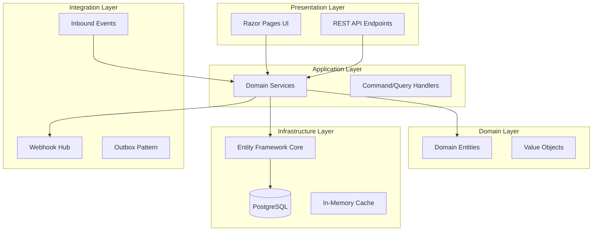
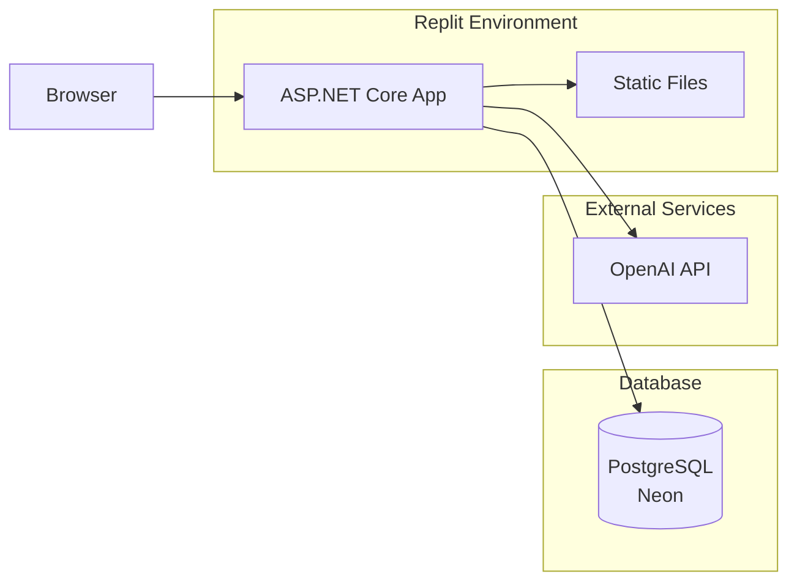

# CherryAI EAM - System Architecture
Last updated: 2026-01-24


## System Overview

CherryAI Enterprise Asset Management (EAM) is a comprehensive fixed asset and maintenance management system built for holding companies with multiple manufacturing subsidiaries. It provides GAAP & tax book depreciation, maintenance tracking, capital improvement project management, and ERP integrations.



## Technology Stack

| Layer | Technology |
|-------|------------|
| Frontend | Razor Pages, Tailwind-inspired CSS, Vanilla JS |
| Backend | ASP.NET Core 9.0 |
| ORM | Entity Framework Core 9.0 |
| Database | PostgreSQL (Neon-backed) |
| Authentication | ASP.NET Core Identity (Cookie-based) |
| PDF Generation | QuestPDF |
| Excel Export | ClosedXML |
| AI Assistant | OpenAI Integration |

## Module Boundaries

### Core Modules

| Module | Responsibility | Key Entities |
|--------|---------------|--------------|
| **Asset Management** | Asset lifecycle (register, transfer, dispose, improve) | Asset, Location, Company |
| **Depreciation** | Multi-book depreciation (GAAP, Tax) | DepreciationBook, DepreciationSchedule |
| **Maintenance** | Work orders and preventive maintenance | WorkOrder, PMSchedule, PMTemplate |
| **Materials** | Item master, inventory, procurement | Item, ItemRevision, VendorPartNumber |
| **Financials** | Chart of accounts, journals, periods | Account, Journal, FiscalPeriod |
| **Integration** | Webhooks, inbound events, mappings | WebhookSubscription, InboundEvent |

### Supporting Modules

| Module | Responsibility |
|--------|---------------|
| **Admin** | User management, system settings, exchange rates |
| **Reports** | Financial reports, T2 Schedule 8, depreciation reports |
| **Audit** | Change tracking, audit log, period locking |
| **Help** | Task guides, glossary, implementation guide |

## Deployment Architecture



## Key Architectural Decisions

| Decision | Rationale | ADR |
|----------|-----------|-----|
| Razor Pages over MVC | Simpler page-focused model for CRUD operations | - |
| EF Core Code-First | Type-safe migrations, easier refactoring | - |
| Cookie Auth over JWT | Simpler for server-rendered pages | - |
| Outbox Pattern for Webhooks | Reliable delivery, at-least-once semantics | [ADR-003](adr/ADR-003-SmokeTest-Transaction-Rollback.md) |
| PMSchedule as Canonical | Single source of truth for PM execution | [ADR-001](adr/ADR-001-PMSchedule-Canonical-Model.md) |

## Directory Structure

```
/
├── Data/                    # EF DbContext, configurations
├── Models/                  # Domain entities
├── Pages/                   # Razor Pages (UI)
│   ├── Admin/              # Admin section
│   ├── Assets/             # Asset management
│   ├── Maintenance/        # Work orders, PM
│   ├── Materials/          # Item master
│   ├── Reports/            # Financial reports
│   └── Shared/             # Layouts, partials
├── Services/               # Domain services
│   ├── Navigation/         # URL helpers
│   ├── Seeding/            # Data seeding
│   ├── Testing/            # Smoke tests
│   └── Webhooks/           # Integration hub
├── wwwroot/                # Static files
│   ├── css/               # Stylesheets
│   └── js/                # JavaScript
├── docs/                   # Documentation
└── tools/                  # Build/CI scripts
```

## Cross-Cutting Concerns

### Logging
- Structured logging via `ILogger<T>`
- Request correlation IDs
- Sensitive data redaction

### Error Handling
- Global exception handler middleware
- User-friendly error pages
- Error detail logging (not exposed to users)

### Caching
- In-memory cache for reference data
- Cache invalidation on data changes
- No distributed cache (single-instance)

### Background Jobs
- `IHostedService` for scheduled tasks
- PM Schedule execution loop
- Webhook dispatcher

## Security Model

See [TenancyAndSecurity.md](TenancyAndSecurity.md) for details.

## Integration Points

See [Integrations.md](Integrations.md) for details.

## Related Documents

- [DomainModel.md](DomainModel.md) - Entity relationships
- [TenancyAndSecurity.md](TenancyAndSecurity.md) - Security model
- [Deployment.md](Deployment.md) - Deployment guide
