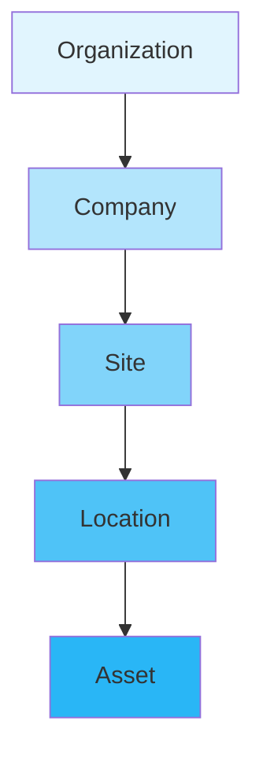
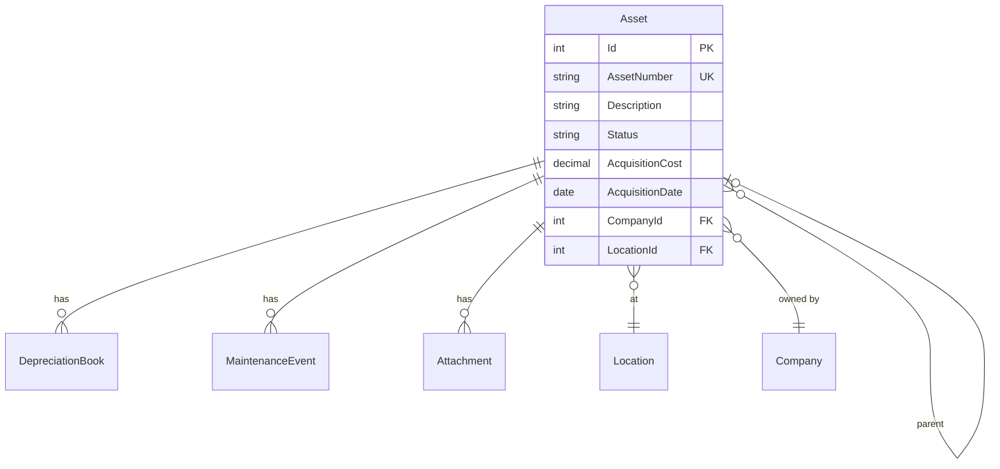
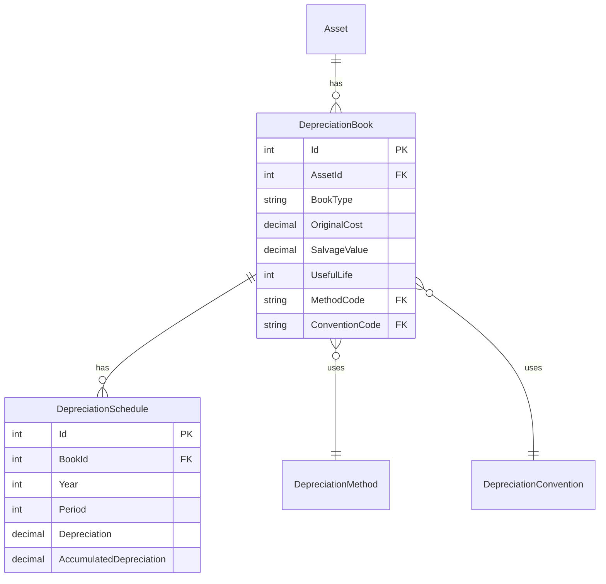
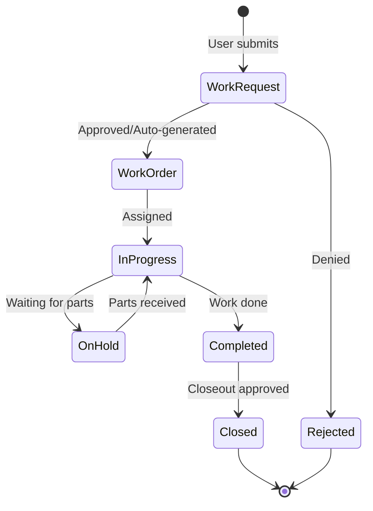
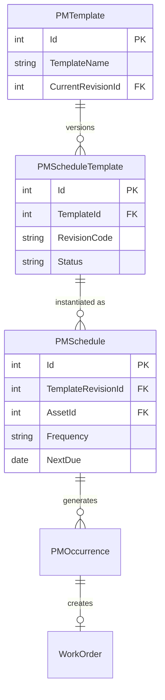
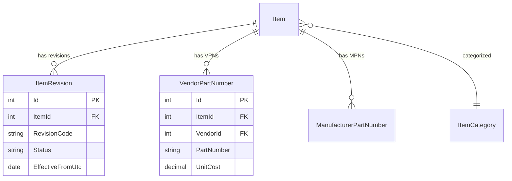
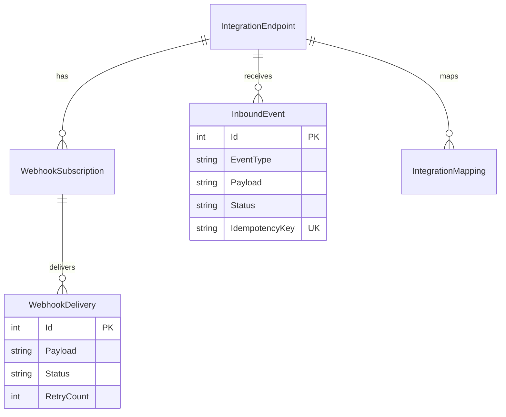
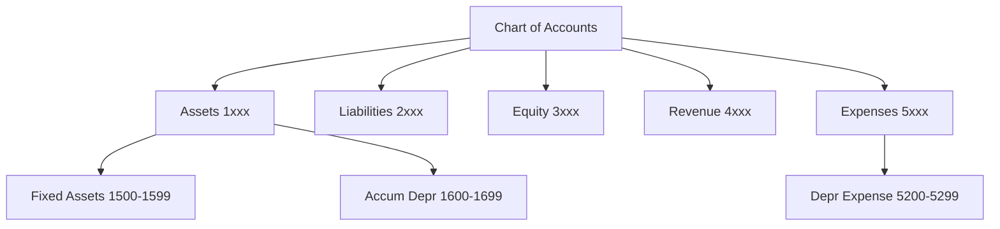

# CherryAI EAM - Domain Model
Last updated: 2026-01-24

## Overview

This document describes the core domain entities and their relationships in CherryAI EAM.

## Organizational Hierarchy

| Entity | Description | Key Fields |
|--------|-------------|------------|
| Organization | Top-level tenant | Name, TenantId |
| Company | Legal entity within org | Code, Name, Currency, FiscalYearEnd |
| Site | Physical facility | Code, Name, Address |
| Location | Area within site | Code, Name, ParentLocationId |
| Asset | Individual asset | AssetNumber, Description, Status |

## Asset Domain

### Core Asset Entity

### Asset Status Values
- `Active` - In service
- `Inactive` - Temporarily out of service
- `Disposed` - Sold, scrapped, or transferred out
- `UnderConstruction` - CIP not yet capitalized

## Depreciation Domain

### Multi-Book Architecture

### Book Types
- `GAAP` - Financial reporting
- `Tax` - Tax compliance (US Federal, State, Canadian)
- `AMT` - Alternative Minimum Tax
- `ACE` - Adjusted Current Earnings

### Depreciation Methods (22 supported)
- Straight Line, Declining Balance, Sum of Years Digits
- MACRS (3-39 year), Canadian CCA Classes

## Maintenance Domain

### Work Execution Flow

### PM Template → Schedule → Occurrence

## Materials Domain

### Item Master with Revisions

### Item Status Values
- `Active` - Available for use
- `Inactive` - Not for new orders
- `Obsolete` - Being phased out
- `Superseded` - Replaced by another item

## Integration Domain

### Webhook & Event Processing

## Financial Domain

### Chart of Accounts Structure

## Multi-Tenant Isolation

All operational entities include tenant/company scoping:

| Scope Level | Filter Pattern |
|-------------|----------------|
| Tenant | `TenantId == currentTenant` |
| Company | `CompanyId == selectedCompany` |
| Site | `SiteId == selectedSite` |

See [TenancyAndSecurity.md](TenancyAndSecurity.md) for enforcement details.

## Key Constraints

### Unique Constraints
- `Asset.AssetNumber` per Company
- `Item.PartNumber` globally
- `InboundEvent.IdempotencyKey` globally

### Referential Integrity
- Cascade delete for child entities (schedules, attachments)
- Restrict delete for referenced entities (locations with assets)

## Related Documents

- [Architecture.md](Architecture.md) - System architecture
- [DatabaseSchema.md](DatabaseSchema.md) - Physical schema
- [PreventiveMaintenance.md](PreventiveMaintenance.md) - PM details
