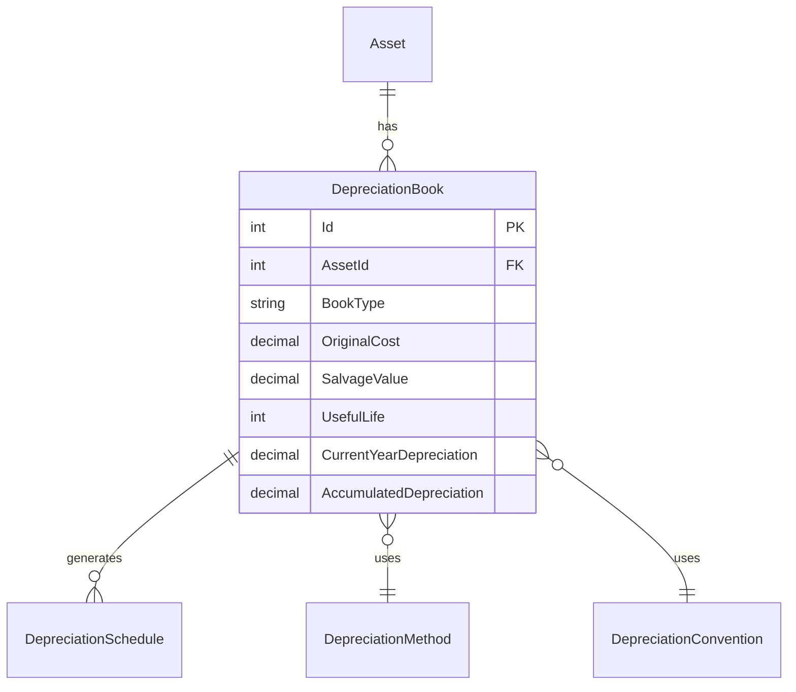
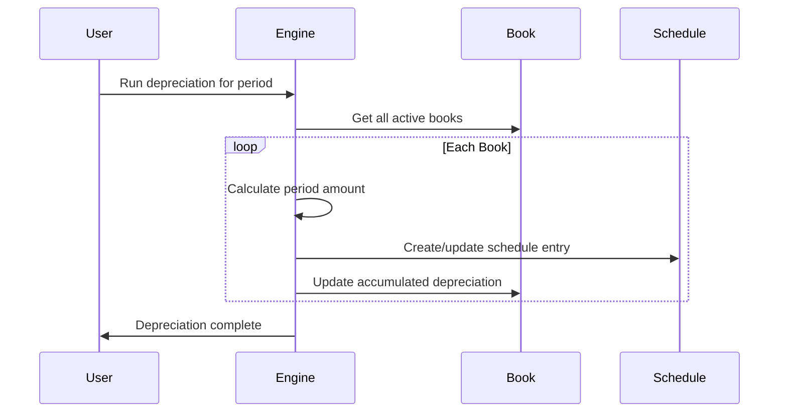
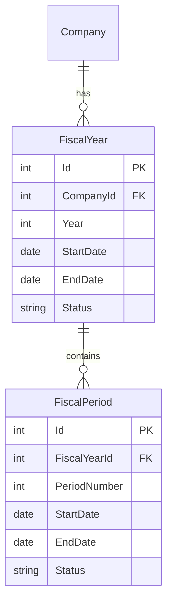

# CherryAI EAM - Financials and Depreciation

**Version:** 2.0  
**Last Updated:** 2026-01-24

---

## Overview

CherryAI EAM provides comprehensive multi-book depreciation supporting GAAP financial reporting and tax compliance for both US and Canadian jurisdictions.

## Multi-Book Architecture

### Book Types

| Book | Purpose | Compliance |
|------|---------|------------|
| GAAP | Financial reporting | US GAAP, IFRS |
| Federal Tax | US Federal tax | IRS regulations |
| State Tax | US State tax | State-specific |
| AMT | Alternative Minimum Tax | IRS AMT rules |
| ACE | Adjusted Current Earnings | Corporate AMT |
| CCA | Capital Cost Allowance | Canadian tax |

### Book Structure



## Depreciation Methods (22 Supported)

### GAAP Methods

| Method Code | Description |
|-------------|-------------|
| SL | Straight Line |
| DB-150 | 150% Declining Balance |
| DB-200 | 200% Declining Balance |
| SYD | Sum of Years Digits |
| UNITS | Units of Production |

### US Tax Methods (MACRS)

| Method Code | Property Class | Recovery Period |
|-------------|---------------|-----------------|
| MACRS-3 | 3-year property | 3 years |
| MACRS-5 | 5-year property | 5 years |
| MACRS-7 | 7-year property | 7 years |
| MACRS-10 | 10-year property | 10 years |
| MACRS-15 | 15-year property | 15 years |
| MACRS-20 | 20-year property | 20 years |
| MACRS-27.5 | Residential rental | 27.5 years |
| MACRS-39 | Nonresidential real | 39 years |

### Canadian CCA Classes

| Class | Description | Rate |
|-------|-------------|------|
| CCA-8 | Manufacturing machinery | 20% |
| CCA-10 | Motor vehicles | 30% |
| CCA-12 | Computer software | 100% |
| CCA-43 | Manufacturing equipment | 30% |
| CCA-50 | Computer equipment | 55% |

## Depreciation Conventions

| Convention | Description | First Year |
|------------|-------------|------------|
| HY | Half-Year | 50% of annual |
| MQ | Mid-Quarter | Varies by quarter |
| MM | Mid-Month | Based on month placed |
| FM | Full-Month | Full month placed |
| NONE | No convention | Full annual |

### Mid-Quarter Test

If >40% of annual acquisitions occur in Q4, mid-quarter convention applies:

```csharp
var q4Acquisitions = assets.Where(a => a.PlacedInService.Quarter == 4).Sum(a => a.Cost);
var totalAcquisitions = assets.Sum(a => a.Cost);
var useMidQuarter = (q4Acquisitions / totalAcquisitions) > 0.40m;
```

## Section 179 and Bonus Depreciation

### Section 179 Expense

Pre-seeded limits by tax year:

| Year | Limit | Phase-Out Threshold |
|------|-------|---------------------|
| 2024 | $1,160,000 | $2,890,000 |
| 2025 | $1,220,000 | $3,050,000 |
| 2026 | $1,290,000 | $3,220,000 |

### Bonus Depreciation Rates

| Year | Rate |
|------|------|
| 2024 | 60% |
| 2025 | 40% |
| 2026 | 20% |
| 2027+ | 0% |

## Depreciation Calculation Engine

### Calculation Flow



### Per-Asset Override

Individual assets can override default methods:

```csharp
public class DepreciationBook
{
    // Override settings (null = use defaults)
    public string? OverrideMethod { get; set; }
    public string? OverrideConvention { get; set; }
    public int? OverrideUsefulLife { get; set; }
    public decimal? OverrideSalvageValue { get; set; }
}
```

## Fiscal Calendar

### FiscalYear and FiscalPeriod



### Period Status

| Status | Description | Transactions |
|--------|-------------|--------------|
| Open | Current period | Allowed |
| Closed | Period closed | Admin only |
| Locked | Permanently locked | None |

## Journal Entries

### Depreciation Journal

Each depreciation run creates journal entries:

| Account | Debit | Credit |
|---------|-------|--------|
| Depreciation Expense (5200) | $1,000 | |
| Accumulated Depreciation (1600) | | $1,000 |

### Journal Structure

```csharp
public class Journal
{
    public int Id { get; set; }
    public DateTime PostDate { get; set; }
    public string JournalType { get; set; }  // DEPR, ACQ, DISP
    public string Reference { get; set; }
    public ICollection<JournalLine> Lines { get; set; }
}
```

## Chart of Accounts

### Standard Account Ranges

| Range | Category |
|-------|----------|
| 1000-1499 | Current Assets |
| 1500-1599 | Fixed Assets |
| 1600-1699 | Accumulated Depreciation |
| 2000-2999 | Liabilities |
| 3000-3999 | Equity |
| 4000-4999 | Revenue |
| 5000-5099 | Cost of Goods Sold |
| 5200-5299 | Depreciation Expense |

## Reports

### Depreciation Reports

| Report | Description |
|--------|-------------|
| Depreciation Schedule | Period-by-period depreciation |
| Book Value Report | Current book values by asset |
| Fully Depreciated | Assets with NBV = 0 |
| Depreciation Forecast | Projected depreciation |

### Tax Reports

| Report | Jurisdiction |
|--------|--------------|
| Form 4562 | US Federal |
| T2 Schedule 8 | Canadian CCA |
| State Schedules | Various US states |

## ERP Integration Mode

### Financial Mode Settings

| Mode | Description |
|------|-------------|
| Standalone | Full GL and depreciation |
| ERP Integration | Depreciation only, export to ERP |

In ERP Integration mode:
- No internal GL posting
- Export depreciation to CSV/API
- ERP handles journal entries

## Related Documents

- [DomainModel.md](DomainModel.md) - Entity relationships
- [Architecture.md](Architecture.md) - System overview
