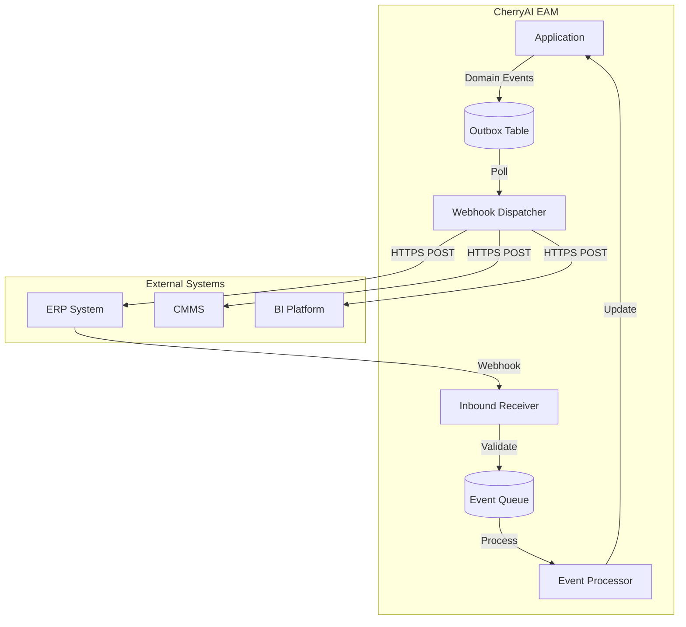
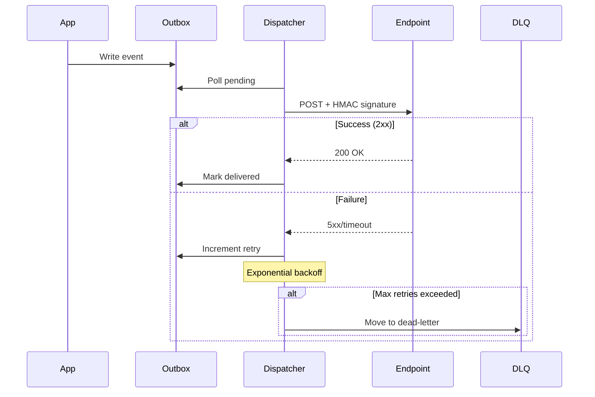
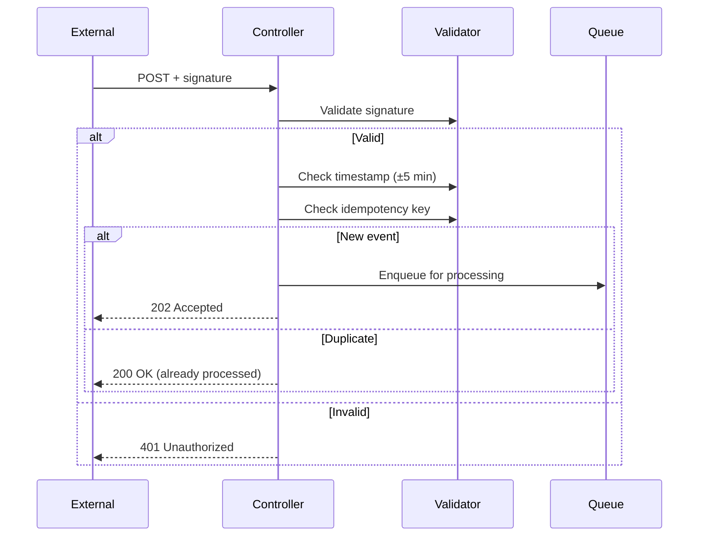

# CherryAI EAM - Integrations

**Version:** 2.0  
**Last Updated:** 2026-01-24

---

## Overview

CherryAI EAM provides a robust integration framework supporting both outbound webhooks and inbound event processing for ERP and third-party system integration.

## Architecture



## Outbound Webhooks

### Webhook Hub Components

| Component | Responsibility |
|-----------|---------------|
| `WebhookSubscription` | Defines endpoint URL and event types |
| `WebhookOutbox` | Stores events for reliable delivery |
| `WebhookDispatcherHostedService` | Background delivery service |
| `WebhookDelivery` | Tracks delivery attempts |

### Supported Event Types

| Event | Trigger | Payload |
|-------|---------|---------|
| `asset.created` | Asset registration | Full asset object |
| `asset.updated` | Asset modification | Changed fields |
| `asset.disposed` | Asset disposal | Disposal details |
| `workorder.created` | WO creation | Full work order |
| `workorder.status.updated` | Status change | Old/new status |
| `workorder.closed` | WO closeout | Summary |
| `depreciation.calculated` | Period close | Depreciation amounts |

### Delivery Flow



### HMAC-SHA256 Signing

All webhook payloads are signed:

```
X-Webhook-Signature: sha256=abc123...
X-Webhook-Timestamp: 1706097600
```

Verification:
```csharp
var payload = timestamp + "." + body;
var expected = HMACSHA256(payload, secret);
var valid = signature == "sha256=" + expected;
```

### Retry Policy

| Attempt | Delay |
|---------|-------|
| 1 | Immediate |
| 2 | 1 minute |
| 3 | 5 minutes |
| 4 | 30 minutes |
| 5 | 2 hours |
| 6+ | Dead-letter queue |

## Inbound Webhooks

### Inbound Event Processing

| Component | Responsibility |
|-----------|---------------|
| `InboundWebhookController` | Receives HTTP requests |
| `InboundEvent` | Stores pending events |
| `InboundEventProcessor` | Background processing |
| `IntegrationMapping` | External → Internal ID mapping |

### Request Validation



### Supported Inbound Commands

| Event Type | Action |
|------------|--------|
| `asset.updated` | Update asset fields via mapping |
| `workorder.status.updated` | Update WO status |
| `inventory.adjusted` | Adjust inventory quantities |

### ID Mapping

External systems use their own IDs. Mappings translate:

| External System | External ID | Internal Entity | Internal ID |
|-----------------|-------------|-----------------|-------------|
| SAP | `EQ-10045` | Asset | 123 |
| Maximo | `WO-2024-001` | WorkOrder | 456 |

## Integration Endpoints

### Endpoint Configuration

```json
{
  "id": 1,
  "name": "SAP Integration",
  "baseUrl": "https://sap.company.com/api",
  "secret": "********",
  "isActive": true,
  "eventTypes": ["asset.created", "asset.updated"],
  "createdAt": "2026-01-15T00:00:00Z"
}
```

### Admin UI

- Create/edit endpoints: `/Admin/Integrations`
- View delivery history: `/Admin/Integrations/Deliveries`
- Manage mappings: `/Admin/Integrations/Mappings`
- View event queue: `/Admin/Integrations/Events`

## Dead-Letter Queue

Failed events move to DLQ after max retries:

| Action | Description |
|--------|-------------|
| View | Inspect failed payload |
| Retry | Re-attempt delivery |
| Discard | Permanently delete |
| Export | Download for analysis |

## Idempotency

### Guarantees

- **At-least-once delivery** for outbound webhooks
- **Exactly-once processing** for inbound events

### Implementation

```csharp
// Inbound events use idempotency key
var existing = await _db.InboundEvents
    .FirstOrDefaultAsync(e => e.IdempotencyKey == key);

if (existing != null)
    return Ok(); // Already processed

// Process new event...
```

## Security

### Outbound Security
- HMAC-SHA256 signature on all payloads
- TLS 1.2+ required for endpoints
- Secret rotation support

### Inbound Security
- Signature verification required
- Timestamp tolerance (±5 minutes)
- IP allowlisting (optional)
- Rate limiting

## Monitoring

### Health Metrics

| Metric | Description |
|--------|-------------|
| `webhook_deliveries_pending` | Queue depth |
| `webhook_deliveries_failed` | Failed attempts |
| `webhook_dlq_size` | Dead-letter count |
| `inbound_events_pending` | Inbound queue |

### Alerting Triggers

- DLQ size > 10
- Delivery success rate < 95%
- Processing latency > 5 minutes

## Related Documents

- [Architecture.md](Architecture.md) - System overview
- [Architecture/Tenant-Control-Plane.md](Architecture/Tenant-Control-Plane.md) - Multi-tenant integration
