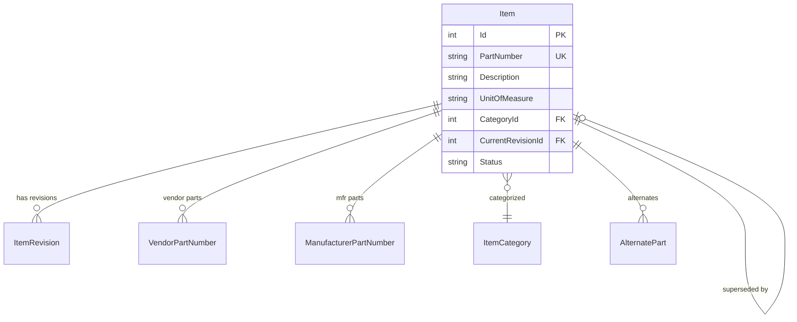
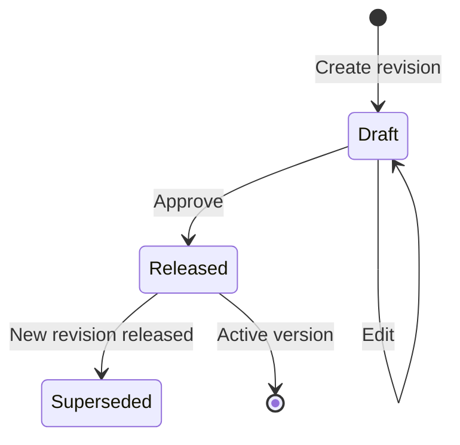
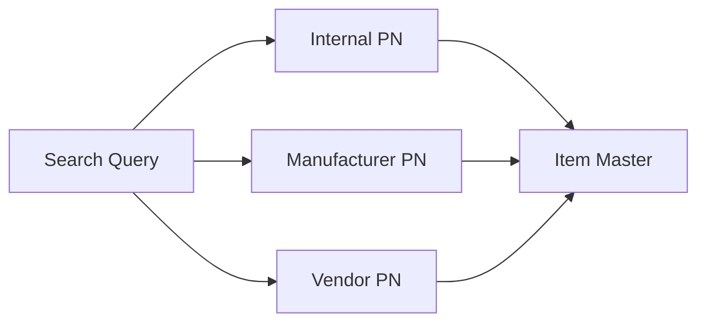
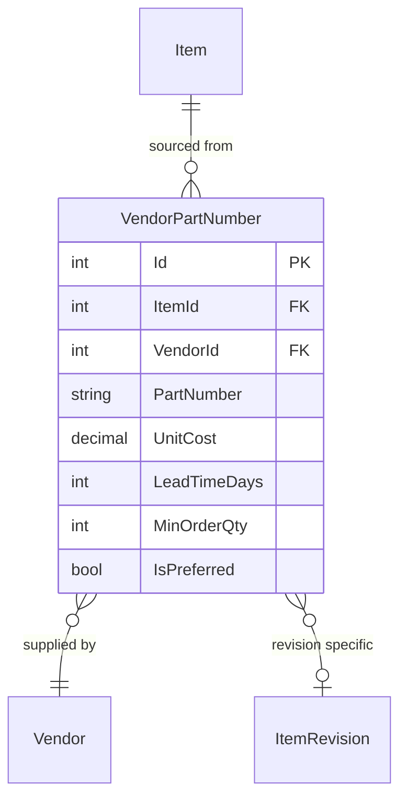
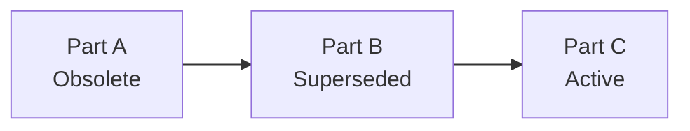
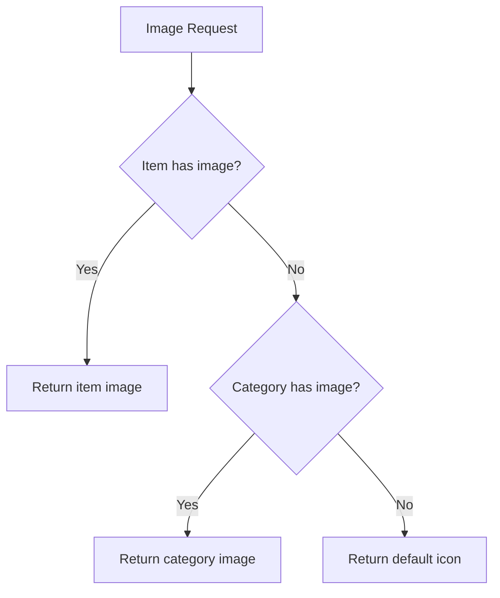
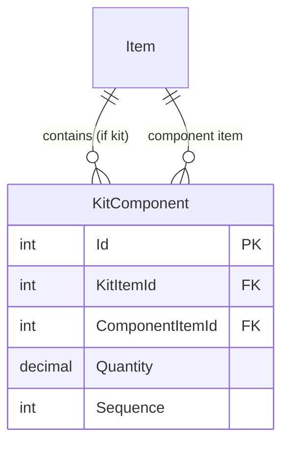

# CherryAI EAM - Materials Management

**Version:** 2.0  
**Last Updated:** 2026-01-24

---

## Overview

Materials Management in CherryAI EAM provides comprehensive Item Master management with revision control, vendor cross-referencing, and procurement-grade features for maintenance parts and consumables.

## Item Master

### Core Structure



### Item Status

| Status | Description | Usage |
|--------|-------------|-------|
| Active | Available for use | Order, issue |
| Inactive | Temporarily unavailable | View only |
| Obsolete | Being phased out | Consume only |
| Superseded | Replaced by another | Redirect to new |

## Item Revision Control

### Revision Lifecycle



### One-Draft Rule

Only one draft revision per item at a time:

```csharp
// Enforced in service layer
var existingDraft = await _db.ItemRevisions
    .AnyAsync(r => r.ItemId == itemId && r.Status == "Draft");

if (existingDraft)
    throw new InvalidOperationException("Item already has a draft revision");
```

### Revision Fields

| Field | Description |
|-------|-------------|
| RevisionCode | A, B, C... or 01, 02, 03 |
| Status | Draft, Released, Superseded |
| EffectiveFromUtc | When revision became active |
| EffectiveToUtc | When superseded (null if current) |
| ChangeReason | Why revision was created |

See [Architecture/ItemCrossReference.md](Architecture/ItemCrossReference.md) for details.

## Three-Way Part Number Resolution

### Cross-Reference Types

| Type | Description | Example |
|------|-------------|---------|
| Internal | CherryAI part number | `ITM-10045` |
| Manufacturer (MPN) | OEM part number | `SKF-6205-2RS` |
| Vendor (VPN) | Supplier part number | `GRAINGER-5A123` |

### Resolution Priority



### Lookup Service

```csharp
public async Task<Item?> ResolvePartNumber(string query)
{
    // Try internal first
    var item = await _db.Items.FirstOrDefaultAsync(i => i.PartNumber == query);
    if (item != null) return item;
    
    // Try manufacturer part number
    var mpn = await _db.ManufacturerPartNumbers
        .Include(m => m.Item)
        .FirstOrDefaultAsync(m => m.PartNumber == query);
    if (mpn != null) return mpn.Item;
    
    // Try vendor part number
    var vpn = await _db.VendorPartNumbers
        .Include(v => v.Item)
        .FirstOrDefaultAsync(v => v.PartNumber == query);
    if (vpn != null) return vpn.Item;
    
    return null;
}
```

## Approved Vendor List (AVL)

### AVL Structure



### Preferred Vendor

Each item can have one preferred vendor:

| VPN | Vendor | Unit Cost | Lead Time | Preferred |
|-----|--------|-----------|-----------|-----------|
| ABC-123 | Grainger | $25.00 | 3 days | Yes |
| DEF-456 | MSC | $27.50 | 2 days | No |
| GHI-789 | Fastenal | $24.00 | 5 days | No |

## Effective Procurement Value Cascade

When procurement values aren't set on the Item, cascade from preferred vendor:

```csharp
public class EffectiveProcurementService
{
    public async Task<ProcurementValues> GetEffective(int itemId)
    {
        var item = await _db.Items
            .Include(i => i.VendorPartNumbers.Where(v => v.IsPreferred))
            .FirstAsync(i => i.Id == itemId);
        
        var preferred = item.VendorPartNumbers.FirstOrDefault();
        
        return new ProcurementValues
        {
            UnitCost = item.StandardCost ?? preferred?.UnitCost ?? 0,
            LeadTime = item.LeadTimeDays ?? preferred?.LeadTimeDays ?? 0,
            MinOrder = item.MinOrderQty ?? preferred?.MinOrderQty ?? 1
        };
    }
}
```

## Alternate Parts

### Alternate Relationships

| Relationship | Description |
|--------------|-------------|
| Substitute | Can be used interchangeably |
| Equivalent | Same form/fit/function |
| Supersession | Replaces discontinued part |

### Supersession Chain



## Buyability Tier System

### Tier Definitions

| Tier | Label | Criteria |
|------|-------|----------|
| 1 | Ready to Buy | All procurement fields complete |
| 2 | Near Ready | Has vendor, missing some fields |
| 3 | Needs Work | No vendors assigned |
| 4 | Not Buyable | Obsolete or inactive |

### Readiness Checklist

| Check | Requirement |
|-------|-------------|
| Has Vendor | At least one VPN |
| Has Cost | Unit cost > 0 |
| Has Lead Time | Lead time defined |
| Has Min Order | Minimum order qty set |
| Active Status | Item status = Active |

## Catalog Intelligence

### Auto-Extraction from URLs

When vendor catalog URL is provided, extract metadata:

```csharp
public async Task<CatalogMetadata> ExtractFromUrl(string url)
{
    var html = await _httpClient.GetStringAsync(url);
    
    // Try OpenGraph tags
    var og = ParseOpenGraph(html);
    
    // Try JSON-LD structured data
    var jsonLd = ParseJsonLd(html);
    
    return new CatalogMetadata
    {
        Title = og.Title ?? jsonLd.Name,
        Description = og.Description ?? jsonLd.Description,
        Price = jsonLd.Price,
        ImageUrl = og.Image
    };
}
```

## Item Image Upload

### Image Handling

| Feature | Description |
|---------|-------------|
| Upload | Click-to-upload on ItemEdit hero |
| Formats | PNG, JPG, WEBP (max 5MB) |
| Storage | `/uploads/items/{itemId}/` |
| Fallback | Category icon → Generic icon |

### Layered Resolution



## Kits and Assemblies

### Kit Structure

A kit bundles multiple items:



### Kit Explosion

When issuing a kit to a work order:
1. Deduct kit quantity
2. Track component consumption
3. Update component inventory

## Related Documents

- [DomainModel.md](DomainModel.md) - Entity relationships
- [Architecture/ItemSourcing.md](Architecture/ItemSourcing.md) - Procurement cascade
- [Architecture/ItemCrossReference.md](Architecture/ItemCrossReference.md) - Part number resolution
