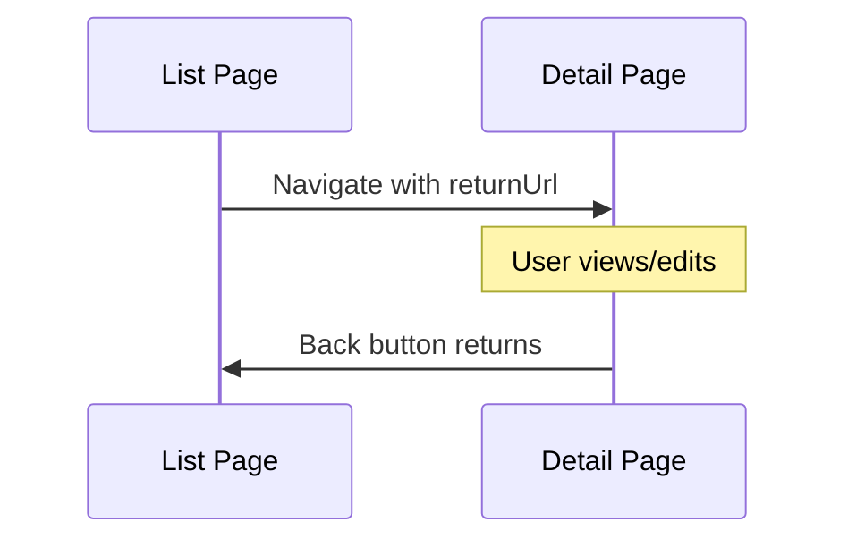

# CherryAI EAM - Navigation and Routing
Last updated: 2026-01-24


## Overview

This document describes the navigation structure, routing conventions, and return URL handling for CherryAI EAM.

## Sidebar Navigation

### Structure

The sidebar is defined in `Pages/Shared/_ModernLayout.cshtml`:

```
├── Quick Actions (Dashboard)
├── Work Orders (Cockpit)
├── Work Requests
├── PM Schedules
├── Capital Projects (CIP)
├── Assets (expandable)
│   └── Asset Register
├── Help Center
└── Sign In/Sign Out
```

### Navigation Rules

| Rule | Description |
|------|-------------|
| Active State | Highlight current section |
| Auto-Expand | Expand section containing active page |
| Lazy Load | Don't load child items until expanded |
| Persistence | Remember expanded state |

### Adding Navigation Items

1. Edit `_ModernLayout.cshtml`
2. Add new `<li>` in appropriate section
3. Update [RouteRegistry.md](RouteRegistry.md)
4. Run smoke tests

## Route Registry

**[RouteRegistry.md](RouteRegistry.md) is the CANONICAL SOURCE OF TRUTH for all routes.**

### Route Format

| Field | Description |
|-------|-------------|
| Sidebar Label | Text shown in navigation |
| Route | URL path |
| Page Title | Browser title |
| Auth | Required authentication |
| Status | Active, Deprecated, etc. |

### Adding New Routes

1. Create Razor Page in `Pages/`
2. Add entry to RouteRegistry.md
3. Add to sidebar if needed
4. Run navigation smoke tests

## Return URL Pattern

### Overview

All drill-down navigation must preserve context via return URLs:



### Implementation

**Source Page (passes returnUrl):**
```razor
@{
    var returnUrl = $"{HttpContext.Request.Path}{HttpContext.Request.QueryString}";
}

<a asp-page="/Assets/Asset" 
   asp-route-id="@asset.Id" 
   asp-route-returnUrl="@returnUrl">
    View Asset
</a>
```

**Detail Page (receives returnUrl):**
```csharp
public class AssetModel : PageModel
{
    [BindProperty(SupportsGet = true)]
    public string? ReturnUrl { get; set; }
}
```

**Rendering back link:**
```razor
<partial name="_BackLink" model="new { ReturnUrl = Model.ReturnUrl, DefaultUrl = "/Assets" }" />
```

### ReturnUrl Security

All return URLs are validated:

```csharp
// ReturnUrlHelper.cs validates:
// - No external URLs (http://, https://)
// - No protocol-relative URLs (//)
// - No path traversal (..)
// - No XSS vectors (<, >, ", ')
```

See [ADR-006](adr/ADR-006-ReturnUrl-Security-Hardening.md) for details.

## DataGrid Row Navigation

### data-row-href Contract

All clickable grid rows use server-generated URLs:

```razor
<tr data-row-id="@asset.Id" 
    data-row-href="@Url.Page("/Assets/Asset", new { id = asset.Id, returnUrl = returnUrl })">
```

### Why Server-Generated URLs

- Pages with `@page "{id:int}"` require route segments (`/Asset/123`)
- Pages with `@page` use query strings (`/Asset?id=123`)
- `Url.Page()` automatically handles both cases

See [DataGridPremium.md](DataGridPremium.md) for full contract.

## Page Types

### List Pages

| Pattern | Example |
|---------|---------|
| Route | `/Assets` |
| Purpose | Display collection |
| Features | Search, filter, sort |
| Navigation | Rows link to detail |

### Detail Pages

| Pattern | Example |
|---------|---------|
| Route | `/Assets/Asset/{id}` |
| Purpose | View/edit single item |
| Features | Back link, tabs |
| Navigation | Back to list |

### Action Pages

| Pattern | Example |
|---------|---------|
| Route | `/Assets/Transfer` |
| Purpose | Perform action |
| Features | Form, confirmation |
| Navigation | Cancel returns, success redirects |

## Breadcrumbs

### Structure

```
Dashboard > Assets > Asset Register > ASSET-001
```

### Implementation

Set via ViewData in page:

```csharp
ViewData["Breadcrumb"] = new[]
{
    ("Dashboard", "/"),
    ("Assets", "/Assets"),
    ("Asset Register", "")  // Empty URL = current page
};
```

## Deep Linking

### Supported Parameters

| Parameter | Purpose | Example |
|-----------|---------|---------|
| `id` | Entity identifier | `/Asset/123` |
| `returnUrl` | Return navigation | `/Asset/123?returnUrl=/Assets` |
| `tab` | Active tab | `/Asset/123?tab=maintenance` |
| `filter` | Pre-applied filter | `/Assets?status=Active` |

### URL Building

Use `Url.Page()` for all internal links:

```razor
@Url.Page("/Assets/Asset", new { id = 123, returnUrl = "/Assets" })
```

## Adaptive Navigation

### Financial Mode

Navigation adapts based on Financial Mode setting:

| Mode | Hidden Sections |
|------|-----------------|
| Standalone | None |
| ERP Integration | GL, Journals |

### User Role

Navigation adapts based on user role:

| Section | Admin | Accountant | Viewer |
|---------|-------|------------|--------|
| Admin | Yes | No | No |
| Reports | Yes | Yes | View only |
| Settings | Yes | No | No |

## Smoke Test Coverage

### Navigation Tests

| Test | Validates |
|------|-----------|
| Nav-01 | All sidebar links resolve |
| Nav-02 | asp-page targets valid |
| Nav-03 | Breadcrumb consistency |
| Return-01 | Open redirect protection |
| Return-02 | Detail pages accept returnUrl |
| Return-03 | Source pages pass returnUrl |

## Related Documents

- [RouteRegistry.md](RouteRegistry.md) - Route catalog
- [DataGridPremium.md](DataGridPremium.md) - Grid navigation
- [ReturnPathAuditReport.md](ReturnPathAuditReport.md) - Implementation report
- [adr/ADR-006-ReturnUrl-Security-Hardening.md](adr/ADR-006-ReturnUrl-Security-Hardening.md) - Security ADR
