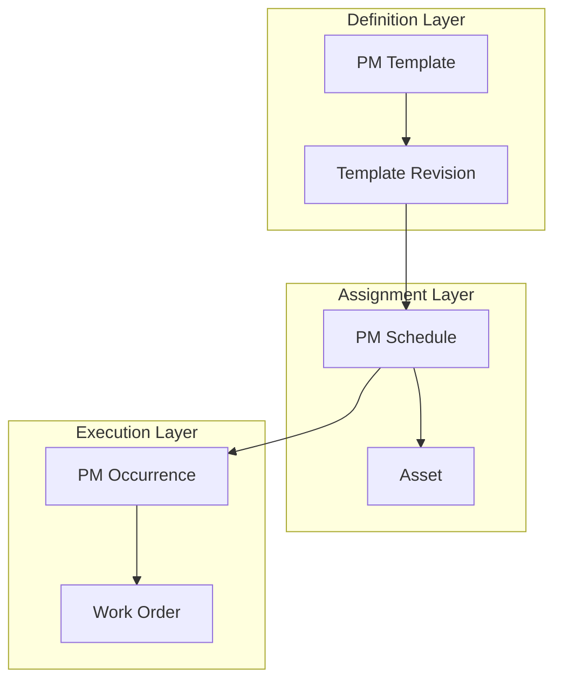
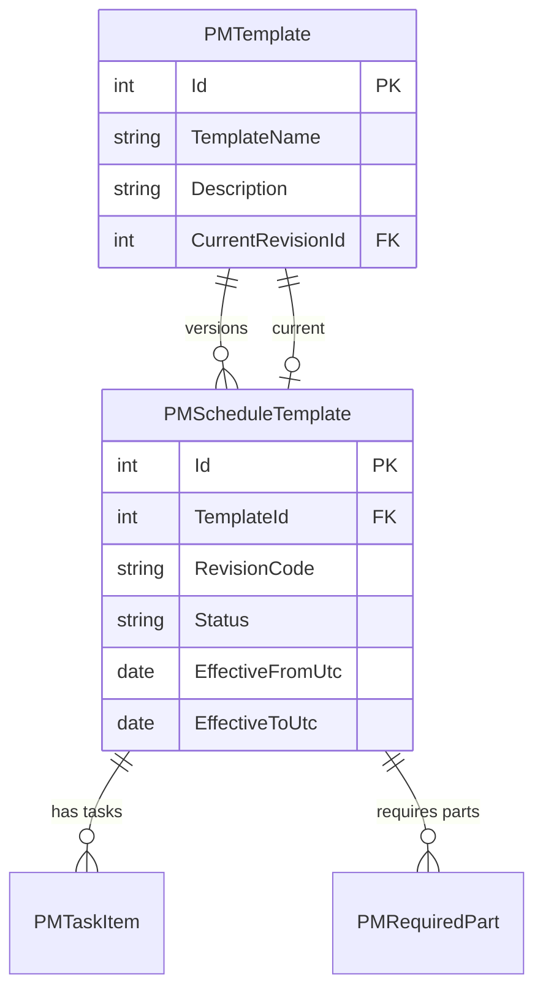
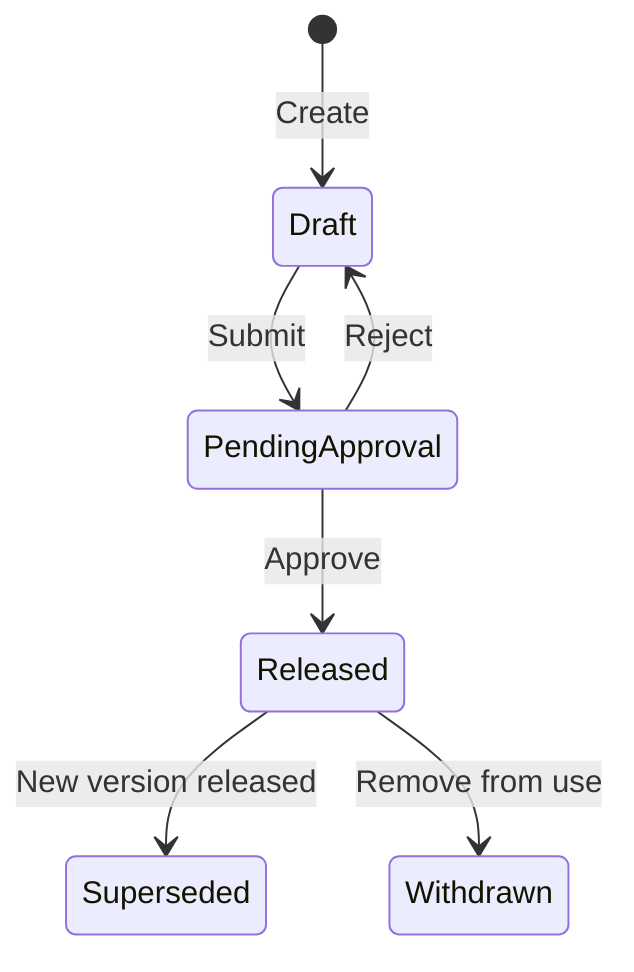
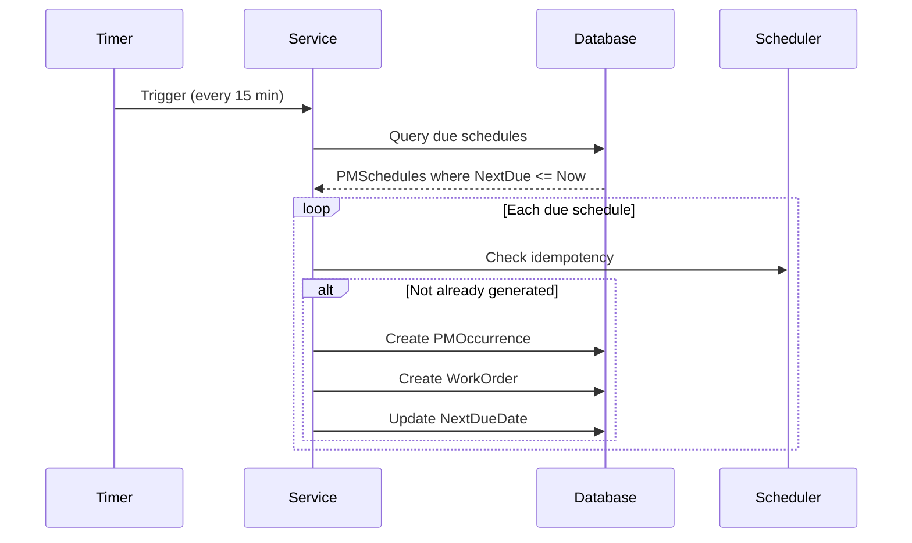
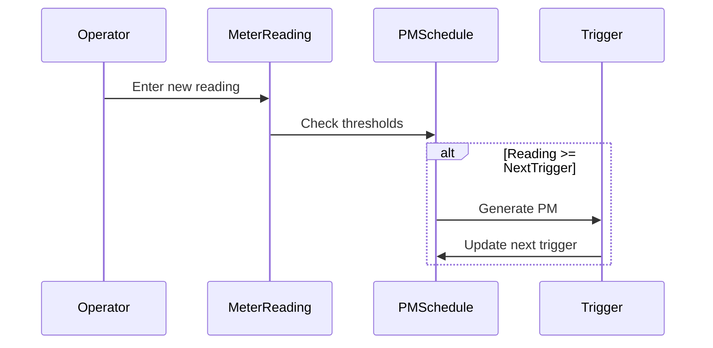

# CherryAI EAM - Preventive Maintenance

**Version:** 2.0  
**Last Updated:** 2026-01-24

---

## Overview

Preventive Maintenance (PM) in CherryAI EAM follows a structured hierarchy from templates through scheduled execution. This document describes the canonical PM model as established in [ADR-001](adr/ADR-001-PMSchedule-Canonical-Model.md).

## PM Hierarchy



## Canonical Model: PMSchedule

**PMSchedule is the single source of truth for PM execution.**

### Why PMSchedule is Canonical

| Concern | PMSchedule | Legacy MaintenanceSchedule |
|---------|------------|---------------------------|
| Template versioning | Links to specific revision | No version tracking |
| Tenant isolation | Full Company/Site scoping | Limited |
| Occurrence tracking | Via PMOccurrence | Direct WO only |
| Cadence flexibility | Interval-based with units | Fixed frequency |
| Used for KPIs | Yes | No |

See [PM-Schedule-Consistency.md](PM-Schedule-Consistency.md) for detailed analysis.

## PM Template with Revision Control

### Template Structure



### Revision Status Values

| Status | Description | Editable |
|--------|-------------|----------|
| Draft | Under development | Yes |
| PendingApproval | Awaiting review | No |
| Released | Active for use | No |
| Superseded | Replaced by newer | No |
| Withdrawn | Removed from use | No |

### Revision Workflow



## PM Schedule (Assignment)

### Schedule Structure

```csharp
public class PMSchedule
{
    public int Id { get; set; }
    public int TemplateRevisionId { get; set; }  // Links to specific version
    public int AssetId { get; set; }
    public int CompanyId { get; set; }           // Tenant scoping
    public int? SiteId { get; set; }             // Optional site filter
    
    // Cadence
    public int IntervalValue { get; set; }       // e.g., 30
    public string IntervalUnit { get; set; }     // Days, Weeks, Months
    
    // Tracking
    public DateTime NextDueDate { get; set; }
    public DateTime? LastCompletedDate { get; set; }
    public bool IsActive { get; set; }
}
```

### Interval Units

| Unit | Description |
|------|-------------|
| Days | Calendar days |
| Weeks | 7-day intervals |
| Months | Calendar months |
| Quarters | 3-month periods |
| Years | Annual |
| RuntimeHours | Based on meter reading |

## PM Execution Loop

### Background Service

The `PMExecutionHostedService` runs periodically:



### Idempotent Generation

Prevents duplicate work orders:

```csharp
// Check if occurrence already exists for this due date
var existing = await _db.PMOccurrences
    .AnyAsync(o => o.ScheduleId == schedule.Id 
                && o.DueDate == schedule.NextDueDate);

if (!existing)
{
    // Generate new occurrence
}
```

## PM Occurrence

Tracks each instance of PM execution:

```csharp
public class PMOccurrence
{
    public int Id { get; set; }
    public int ScheduleId { get; set; }
    public DateTime DueDate { get; set; }
    public int? WorkOrderId { get; set; }
    public string Status { get; set; }  // Pending, Generated, Completed, Skipped
    public string? SkipReason { get; set; }
}
```

### Occurrence Status

| Status | Description |
|--------|-------------|
| Pending | Due, not yet generated |
| Generated | Work order created |
| Completed | Work order closed |
| Skipped | Manually skipped with reason |

## Meter-Based PM

For runtime/cycle-based maintenance:



### Meter Configuration

| Field | Description |
|-------|-------------|
| MeterType | Hours, Cycles, Miles |
| TriggerInterval | Interval between PMs |
| CurrentReading | Latest reading |
| LastTriggerReading | Reading when last PM generated |

## PM Compliance Metrics

### Key Metrics

| Metric | Calculation |
|--------|-------------|
| PM Compliance | Completed on-time / Total due |
| Overdue PMs | Due date < Today & not completed |
| PM Work Ratio | PM work orders / Total work orders |
| MTBPM | Mean time between PM events |

### Dashboard Queries

```sql
-- PM Compliance Rate
SELECT 
    COUNT(CASE WHEN CompletedDate <= DueDate THEN 1 END) * 100.0 / COUNT(*) 
FROM PMOccurrence 
WHERE Status = 'Completed';
```

## Seeding PM Data

### DemoPackV2 PM Seed

The canonical demo seed includes:

```csharp
// PM Template
new PMTemplate { Name = "Monthly Lubrication", ... }

// Template Revision
new PMScheduleTemplate { RevisionCode = "A", Status = "Released", ... }

// PM Schedule assigned to asset
new PMSchedule { 
    AssetId = 1, 
    IntervalValue = 30, 
    IntervalUnit = "Days",
    NextDueDate = DateTime.Today.AddDays(7)
}
```

## UI Pages

| Page | Purpose |
|------|---------|
| `/Maintenance/Schedules` | List all PM schedules |
| `/Admin/PMScheduleEdit/{id}` | Edit schedule |
| `/Admin/PMTemplates` | Manage templates |
| `/Admin/PMTemplateRevision/{id}` | Edit revision |

## Related Documents

- [WorkExecution.md](WorkExecution.md) - Work order lifecycle
- [PM-Schedule-Consistency.md](PM-Schedule-Consistency.md) - Model analysis
- [adr/ADR-001-PMSchedule-Canonical-Model.md](adr/ADR-001-PMSchedule-Canonical-Model.md) - ADR
