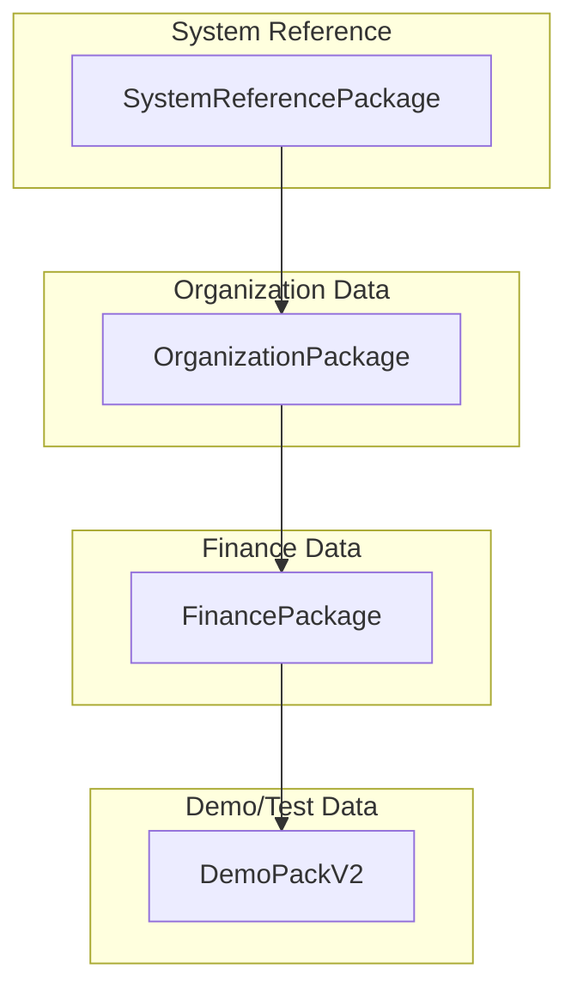

# CherryAI EAM - Seeding and Demo Data
Last updated: 2026-01-24


## Overview

CherryAI EAM uses versioned seed packages for populating system reference data, demo data, and test fixtures. This document describes the canonical seeding architecture.

## Seed Architecture

### Package Hierarchy



### Execution Order

| Order | Package | Purpose |
|-------|---------|---------|
| 1 | SystemReferencePackage | Depreciation methods, conventions |
| 2 | OrganizationPackage | Companies, sites, locations |
| 3 | FinancePackage | Chart of accounts, fiscal years |
| 4 | VendorPackage | Vendors, vendor parts |
| 5 | PartsPackage | Items, categories, revisions |
| 6 | EAMExecutionPackage | PM templates, schedules |
| 7 | DemoPackV2 | Demo assets, work orders |

## DemoPackV2 - Canonical Entry

**DemoPackV2 is the canonical seed entry for smoke tests and demo data.**

See [ADR-002](adr/ADR-002-DemoPackV2-Canonical-Seed.md) for the design decision.

### What It Seeds

| Entity | Count | Examples |
|--------|-------|----------|
| Assets | 5+ | CNC Lathe, Press Brake, Conveyor |
| Work Orders | 3+ | Open, In Progress, Closed |
| PM Schedules | 2+ | Monthly Lubrication, Quarterly Inspection |
| Items | 10+ | Bearings, Motors, Filters |
| Vendors | 3+ | Grainger, MSC, Fastenal |

### Canonical Identifiers

Tests can rely on these identifiers:

```csharp
// Asset seed data
{ AssetNumber = "ASSET-001", Description = "CNC Lathe Model 500" }
{ AssetNumber = "ASSET-002", Description = "Hydraulic Press Brake" }

// Work Order seed data
{ WorkOrderNumber = "WO-2026-0001", Status = "Open" }

// Item seed data
{ PartNumber = "BRG-6205", Description = "Ball Bearing 6205-2RS" }
```

## Idempotent Upserts

All seed operations are idempotent:

```csharp
// Upsert pattern
var existing = await _db.Assets
    .FirstOrDefaultAsync(a => a.AssetNumber == seed.AssetNumber);

if (existing != null)
{
    // Update existing
    existing.Description = seed.Description;
    existing.Status = seed.Status;
}
else
{
    // Insert new
    _db.Assets.Add(new Asset
    {
        AssetNumber = seed.AssetNumber,
        Description = seed.Description,
        Status = seed.Status
    });
}

await _db.SaveChangesAsync();
```

### Benefits

- Safe to run multiple times
- Updates existing records
- Creates missing records
- No duplicate key errors

## Seed Run Receipts

Each seed run creates an audit receipt:

```csharp
public class SeedRunReceipt
{
    public int Id { get; set; }
    public string PackageName { get; set; }
    public string Version { get; set; }
    public DateTime ExecutedAtUtc { get; set; }
    public string ExecutedBy { get; set; }
    public int RecordsCreated { get; set; }
    public int RecordsUpdated { get; set; }
    public string Status { get; set; }  // Success, PartialFailure, Failed
}
```

See [SeedRunReceipts.md](SeedRunReceipts.md) for receipt format.

## Running Seeds

### Via Admin UI

Navigate to `/Admin/Seed`:

1. Select package(s) to run
2. Click "Execute Seed"
3. View results and receipt

### Via API

```bash
# Run all seeds
curl -X POST http://localhost:5000/api/seed/run

# Run specific package
curl -X POST http://localhost:5000/api/seed/run/DemoPackV2
```

### On Application Startup

In Development mode, seeds run automatically:

```csharp
// Program.cs
if (app.Environment.IsDevelopment())
{
    await seedService.EnsureSeededAsync();
}
```

## LAB vs DEMO Workflow

| Environment | Seed Behavior |
|-------------|---------------|
| LAB | Full reset on each run |
| DEMO | Incremental updates only |
| Production | Manual seed only |

See [LAB-vs-DEMO-Workflow.md](LAB-vs-DEMO-Workflow.md) for details.

## Seed Package Implementation

### Package Interface

```csharp
public interface ISeedPackage
{
    string Name { get; }
    string Version { get; }
    int Order { get; }
    Task<SeedResult> ExecuteAsync(AppDbContext db);
}
```

### Package Example

```csharp
public class DemoPackV2 : ISeedPackage
{
    public string Name => "DemoPackV2";
    public string Version => "2.0.0";
    public int Order => 100;
    
    public async Task<SeedResult> ExecuteAsync(AppDbContext db)
    {
        var result = new SeedResult();
        
        // Seed assets
        result += await SeedAssetsAsync(db);
        
        // Seed work orders
        result += await SeedWorkOrdersAsync(db);
        
        // Seed PM schedules
        result += await SeedPMSchedulesAsync(db);
        
        return result;
    }
}
```

## Reference Data vs Demo Data

### Reference Data (Required)

System reference data that must exist:

| Category | Examples |
|----------|----------|
| Depreciation Methods | SL, DB-150, MACRS-5 |
| Conventions | HY, MQ, MM |
| Tax Limits | Section 179 limits by year |
| Status Codes | Asset statuses, WO statuses |

### Demo Data (Optional)

Sample data for demonstration:

| Category | Examples |
|----------|----------|
| Assets | Sample machines and equipment |
| Work Orders | Sample maintenance history |
| Items | Sample parts inventory |

## Seed Coverage Matrix

Track which entities have seed data:

| Entity | System Ref | Demo Data | Coverage |
|--------|------------|-----------|----------|
| Asset | - | Yes | 100% |
| Company | Yes | - | 100% |
| DepreciationMethod | Yes | - | 100% |
| WorkOrder | - | Yes | 80% |
| PMSchedule | - | Yes | 100% |

See [SeedCoverageMatrix.md](SeedCoverageMatrix.md) for full matrix.

## Troubleshooting

### Common Issues

| Issue | Cause | Solution |
|-------|-------|----------|
| FK violation | Missing parent data | Run packages in order |
| Duplicate key | Non-idempotent insert | Use upsert pattern |
| Missing data | Package not run | Check seed receipts |

### Verifying Seed Status

```sql
-- Check seed receipts
SELECT * FROM seed_run_receipts 
ORDER BY executed_at_utc DESC;

-- Verify specific entity count
SELECT COUNT(*) FROM assets WHERE asset_number LIKE 'ASSET-%';
```

## Related Documents

- [SeedPackages.md](SeedPackages.md) - Package catalog
- [SeedCoverageMatrix.md](SeedCoverageMatrix.md) - Coverage analysis
- [SeederAudit.md](SeederAudit.md) - Implementation audit
- [adr/ADR-002-DemoPackV2-Canonical-Seed.md](adr/ADR-002-DemoPackV2-Canonical-Seed.md) - ADR
