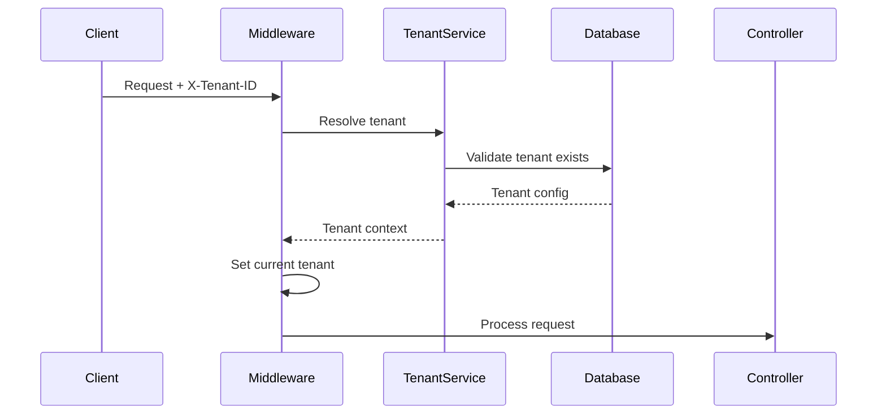
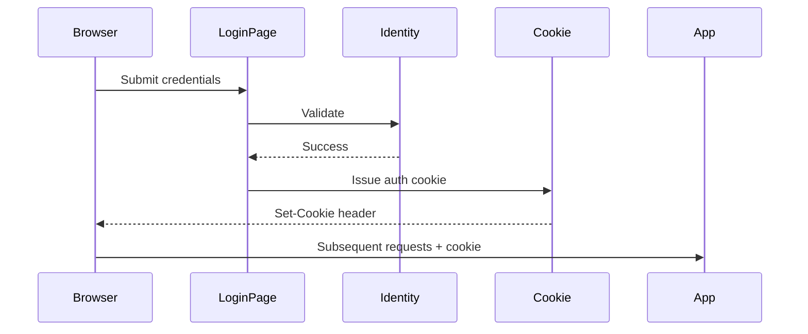
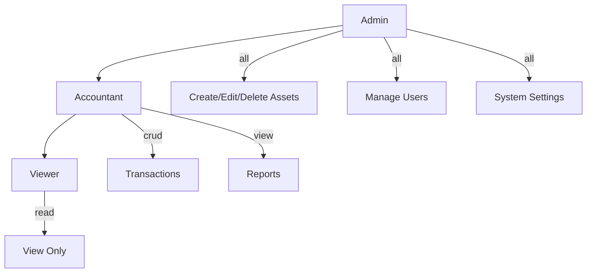
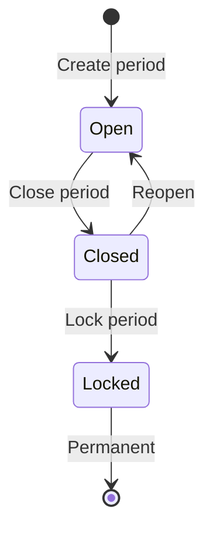

# CherryAI EAM - Tenancy and Security
Last updated: 2026-01-24


## Overview

CherryAI EAM supports both single-tenant (on-premise) and multi-tenant (SaaS) deployments. This document describes the security model, tenant isolation, and authentication/authorization mechanisms.

## Deployment Modes

### Single-Tenant (On-Premise)
- One organization per deployment
- All users belong to same tenant
- Simpler configuration
- `TenantId` can be fixed or omitted

### Multi-Tenant (SaaS)
- Multiple organizations share infrastructure
- Strict data isolation between tenants
- Header-based tenant resolution
- `X-Tenant-ID` header required on API calls

## Tenant Resolution



### Resolution Priority
1. `X-Tenant-ID` header (API calls)
2. Subdomain (if configured)
3. User's default tenant (from claims)
4. Default tenant (single-tenant mode)

## Data Isolation

### Query Scoping

All queries are automatically scoped by tenant:

```csharp
// Global query filter in DbContext
modelBuilder.Entity<Asset>()
    .HasQueryFilter(a => a.CompanyId == _tenantContext.CompanyId);
```

### Isolation Layers

| Layer | Mechanism |
|-------|-----------|
| Database | Row-level security via query filters |
| Application | Tenant context injection |
| API | Header validation middleware |
| UI | Company selector (within tenant) |

## Authentication

### Cookie-Based Authentication



### Authentication Configuration

| Setting | Value |
|---------|-------|
| Scheme | Cookies |
| Cookie Name | `.AspNetCore.Identity.Application` |
| Expiration | Sliding, 14 days |
| Secure | Yes (HTTPS only) |
| HttpOnly | Yes |
| SameSite | Lax |

## Authorization (RBAC)

### Role Hierarchy



### Role Permissions

| Permission | Admin | Accountant | Viewer |
|------------|-------|------------|--------|
| View Assets | Yes | Yes | Yes |
| Create/Edit Assets | Yes | Yes | No |
| Delete Assets | Yes | No | No |
| Run Depreciation | Yes | Yes | No |
| Create Work Orders | Yes | Yes | No |
| Approve Work Orders | Yes | No | No |
| Manage Users | Yes | No | No |
| System Settings | Yes | No | No |

### Authorization Enforcement

```csharp
// Page-level authorization
[Authorize(Roles = "Admin,Accountant")]
public class AssetEditModel : PageModel { }

// Action-level authorization
public async Task<IActionResult> OnPostAsync()
{
    if (!User.IsInRole("Admin"))
        return Forbid();
}
```

## Security Guardrails

### Open Redirect Protection

All return URLs are validated:

```csharp
// ReturnUrlHelper.cs
public static bool IsValidReturnUrl(string url)
{
    // Reject external URLs
    if (url.StartsWith("http://") || url.StartsWith("https://"))
        return false;
    
    // Reject protocol-relative URLs
    if (url.StartsWith("//"))
        return false;
    
    // Reject path traversal
    if (url.Contains(".."))
        return false;
    
    // Reject XSS vectors
    if (url.ContainsAny("<", ">", "\"", "'"))
        return false;
    
    return true;
}
```

### CSRF Protection

- Anti-forgery tokens on all forms
- `[ValidateAntiForgeryToken]` on POST handlers
- Automatic token validation middleware

### SQL Injection Prevention

- Parameterized queries via EF Core
- No raw SQL with user input
- Input validation on all endpoints

### XSS Prevention

- Razor automatic HTML encoding
- Content Security Policy headers
- No inline JavaScript with user data

## Audit Trail

### Tracked Operations

| Entity | Operations Tracked |
|--------|-------------------|
| Asset | Create, Update, Delete, Transfer, Dispose |
| WorkOrder | Create, Update, Status Change, Closeout |
| User | Create, Update, Role Change, Login |
| Settings | Any configuration change |

### Audit Log Entry

```json
{
  "timestamp": "2026-01-24T10:30:00Z",
  "userId": 123,
  "userName": "admin@company.com",
  "action": "Asset.Update",
  "entityId": 456,
  "changes": {
    "Status": { "old": "Active", "new": "Disposed" }
  },
  "ipAddress": "192.168.1.100"
}
```

## Period Locking

### Accounting Period Control



| Status | Can Create Transactions | Can Modify Transactions |
|--------|------------------------|------------------------|
| Open | Yes | Yes |
| Closed | No | Admin only |
| Locked | No | No |

## Threat Model Summary

### Addressed Threats

| Threat | Mitigation |
|--------|------------|
| Tenant data leakage | Query filters, header validation |
| Privilege escalation | Role-based authorization |
| Session hijacking | Secure cookies, HTTPS |
| CSRF | Anti-forgery tokens |
| XSS | Output encoding, CSP |
| SQL Injection | Parameterized queries |
| Open redirect | URL validation |
| Brute force | Account lockout |

### Remaining Risks

| Risk | Mitigation Status |
|------|-------------------|
| DDoS | Rely on hosting platform |
| Supply chain | Dependency scanning (recommended) |
| Insider threat | Audit logging |

## Related Documents

- [Architecture.md](Architecture.md) - System overview
- [adr/ADR-006-ReturnUrl-Security-Hardening.md](adr/ADR-006-ReturnUrl-Security-Hardening.md) - Return URL ADR
- [ReturnPathAuditReport.md](ReturnPathAuditReport.md) - Implementation audit
