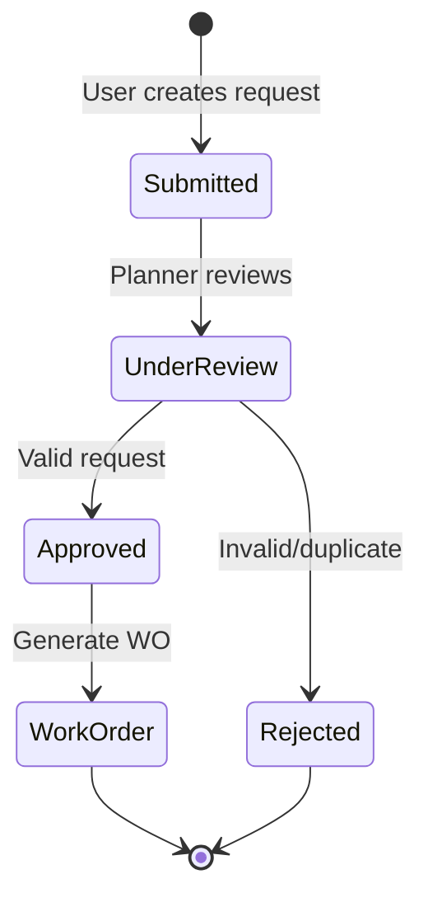
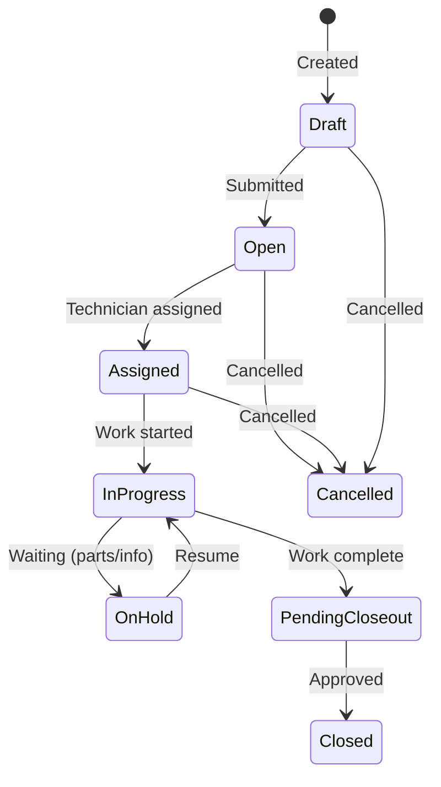
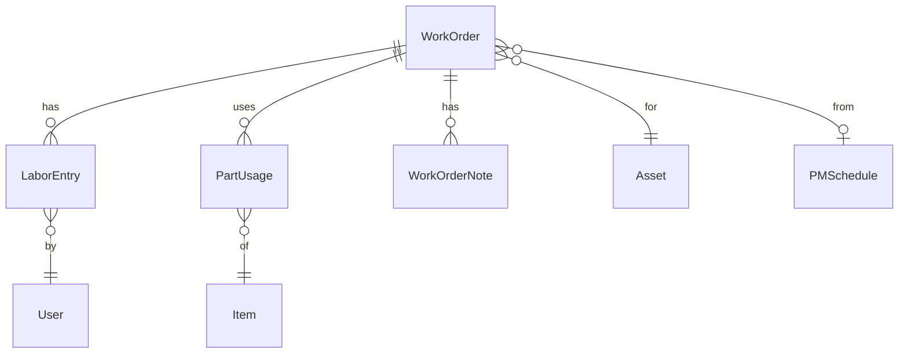
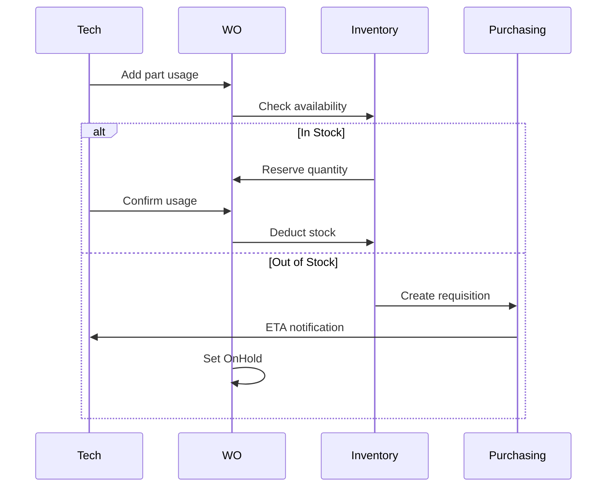

# CherryAI EAM - Work Execution

**Version:** 2.0  
**Last Updated:** 2026-01-24

---

## Overview

Work Execution covers the complete lifecycle from work request through work order completion, including labor tracking, parts consumption, and closeout intelligence.

## Work Request → Work Order Flow



### Smart Assist Rules

Work requests can auto-generate work orders based on rules:

| Rule | Condition | Action |
|------|-----------|--------|
| Emergency | Priority = Critical | Auto-create WO, notify on-call |
| Repeat Issue | Same asset + symptom in 30 days | Link to prior WO |
| PM Trigger | Matches PM description | Create from PM template |
| Auto-Approve | Requester = Maintenance Lead | Skip review |

## Work Order Lifecycle

### State Machine



### Status Definitions

| Status | Description | Allowed Transitions |
|--------|-------------|---------------------|
| Draft | Being prepared | Open, Cancelled |
| Open | Ready for assignment | Assigned, Cancelled |
| Assigned | Technician assigned | InProgress, Open |
| InProgress | Active work | OnHold, PendingCloseout |
| OnHold | Blocked | InProgress |
| PendingCloseout | Awaiting approval | Closed |
| Closed | Complete | (terminal) |
| Cancelled | Abandoned | (terminal) |

## Work Order Structure



### Key Fields

| Field | Description |
|-------|-------------|
| WorkOrderNumber | System-generated (format: WO-YYYY-NNNN) |
| Priority | Low, Medium, High, Critical |
| Type | Corrective, Preventive, Emergency, Project |
| PlannedStart/End | Scheduled window |
| ActualStart/End | Actual execution times |
| EstimatedHours | Planned labor |
| ActualHours | Sum of labor entries |

## Labor Tracking

### Labor Entry Fields

| Field | Description |
|-------|-------------|
| TechnicianId | Who performed work |
| StartTime/EndTime | Clock times |
| Hours | Calculated or manual |
| LaborType | Regular, Overtime, Travel |
| CraftCode | Electrician, Mechanic, etc. |
| Notes | Work performed |

### Labor Rates

Labor costs calculated using craft rates:

```
LaborCost = Hours × CraftRate × (OvertimeMultiplier if OT)
```

## Parts Consumption

### Part Usage Flow



## Closeout Intelligence

### Closeout Fields

| Field | Purpose |
|-------|---------|
| ResolutionSummary | What was done |
| RootCause | Why it failed |
| FailureCode | Standardized code |
| RecommendedAction | Follow-up suggestion |

### Heuristic Analysis

On closeout, system generates insights:

| Heuristic | Description |
|-----------|-------------|
| Recurring Failure | Same failure code 3+ times in 90 days |
| High Cost | Labor + parts > asset value threshold |
| Aging Asset | Asset age + failures suggest replacement |
| PM Effectiveness | Correlate PM frequency with breakdowns |

### Auto-Generated Summary

```
Resolution: Replaced worn bearings on motor shaft.
Root Cause: Normal wear - bearings exceeded L10 life rating.
Recommendation: Adjust PM schedule to inspect bearings every 6 months.
```

## Approval Workflow

### Approval Matrix

| WO Type | Cost < $1K | Cost $1K-$10K | Cost > $10K |
|---------|------------|---------------|-------------|
| Corrective | Auto | Supervisor | Manager |
| Preventive | Auto | Auto | Supervisor |
| Emergency | Auto | Auto | Manager (post-hoc) |
| Project | Supervisor | Manager | Director |

## Notifications

### Event Triggers

| Event | Notify |
|-------|--------|
| WO Created | Assigned technician |
| Priority Changed | All involved parties |
| Parts Arrived | Technician + Planner |
| Overdue | Supervisor |
| Closeout Pending | Approver |

## Audit Trail

All work order changes tracked:

| Action | Fields Logged |
|--------|---------------|
| Status Change | Old/new status, timestamp, user |
| Assignment | Technician change |
| Parts Added | Item, quantity, cost |
| Labor Posted | Hours, craftsman |
| Notes Added | Note content |

## Metrics

### Key Performance Indicators

| KPI | Calculation |
|-----|-------------|
| MTTR | Avg time from Open to Closed |
| MTBF | Avg time between failures per asset |
| Schedule Compliance | Completed on-time / Total scheduled |
| First-Time Fix Rate | Closed without reopen / Total closed |
| Labor Utilization | Actual hours / Available hours |

## Related Documents

- [PreventiveMaintenance.md](PreventiveMaintenance.md) - PM schedules
- [Materials.md](Materials.md) - Parts management
- [DomainModel.md](DomainModel.md) - Entity relationships
